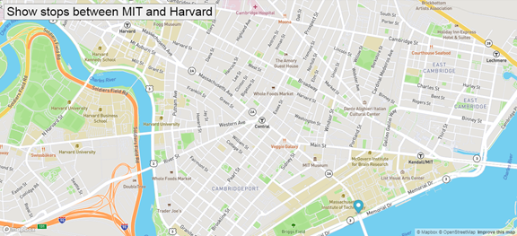

# Real-Time Bus Tracker

Here is one of the exercises we did during the program. On this activity it is possible to see the bus stops just by clicking the button on the upper left corner.

## How to run
  * Click code.
  * Copy the repo's URL using HTTPS.
  * Open your terminal window.
  * Type git clone, and then paste the URL you copied earlier.

## Roadmap
On this exercise, we could make it more challenging by adding more buttons that show other features, such as: roads, another bus route.

## License information
<a href = "LICENCE">MIT<a>
