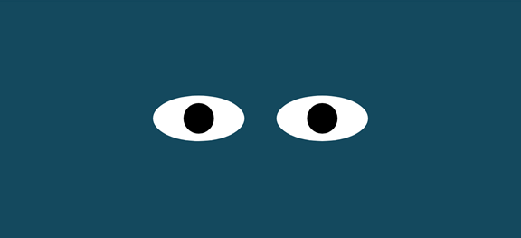

# Eyes Exercise

On this exercise, we added movement. The eyes move if the mouse pointer moves.

## How to run
To run this repo on your computer please follow these instructions:
  * Click code.
  * Copy the repo's URL using HTTPS.
  * Open your terminal window.
  * Type git clone, and then paste the URL you copied earlier.

## Roadmap
This activity can continue by adding other parts of the face. Also, eyes could change of color by clicking on them.

## License information
<a href = "LICENCE">MIT<a>
