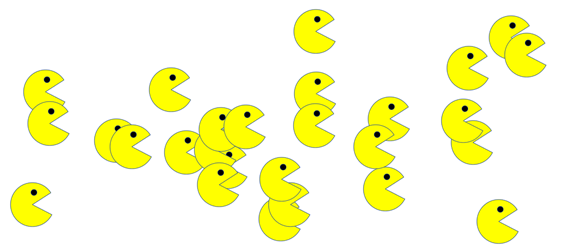

# PacMen

Everybody knows Pacman. It is a fun game. In this activity, the main object is to create many pacmen and make them bounce around.

## How to run
To run this repo on your computer please follow these instructions:
  * Click code.
  * Copy the repo's URL using HTTPS.
  * Open your terminal window.
  * Type git clone, and then paste the URL you copied earlier.

## Roadmap
This activity can continue by adding new images or movement. 

## License information
<a href = "LICENSE">MIT<a>
